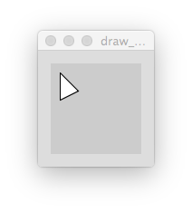
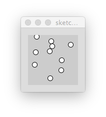

# hello-processing-py-world

Some sketches created @FH-Potsdam 2015.04.15 for showing some processing.py  

##hsb_mode

Shows how to use the `colorMode(HSB)` and draw `rect()` in a `for` loop. Makes use of `size()`
and `noStroke()`

##lines_from_side_to_side  

Draws `line()` in two `for` loops. Once from top to bottom. Once from left to right. Also makes use of `strokeWeight()`

##load_svg  

Uses `list` (in Processing it would be an `Array`) to store file names. Selects `random()` items from that list and draws them in `def draw():`. Also uses `noStroke()`, `frameRate()`, `fill()`, `rect()`, `int()`, `random()`, `len()`, `loadShape()` and `shape()` 

##simple_function  

Shows how to use def `setup():`, `def draw():` and how to declare own functions. Makes use of`beginShape()`, `endShape()` `vertex()` and `ellipse()`

##simple_loop_with_list  

Shows how to store values in a two dimensional `list` and how to access them. Makes use of `for` loops, `len()`, `list.append()`, `random()`, `int()` and `ellipse()`

##draw_triangle

  

##pvectors  

  

Copyright (c) 2015 Fabian Moron Zirfas & FH-Potsdam

Permission is hereby granted, free of charge, to any person obtaining a copy of this software and associated documentation files (the "Software"), to deal in the Software without restriction, including without limitation the rights to use, copy, modify, merge, publish, distribute, sublicense, and/or sell copies of the Software, and to permit persons to whom the Software is furnished to do so, subject to the following conditions:  

The above copyright notice and this permission notice shall be included in all copies or substantial portions of the Software.  

THE SOFTWARE IS PROVIDED "AS IS", WITHOUT WARRANTY OF ANY KIND, EXPRESS OR IMPLIED, INCLUDING BUT NOT LIMITED TO THE WARRANTIES OF MERCHANTABILITY, FITNESS FOR A PARTICULAR PURPOSE AND NONINFRINGEMENT. IN NO EVENT SHALL THE AUTHORS OR COPYRIGHT HOLDERS BE LIABLE FOR ANY CLAIM, DAMAGES OR OTHER LIABILITY, WHETHER IN AN ACTION OF CONTRACT, TORT OR OTHERWISE, ARISING FROM, OUT OF OR IN CONNECTION WITH THE SOFTWARE OR THE USE OR OTHER DEALINGS IN THE SOFTWARE.  

